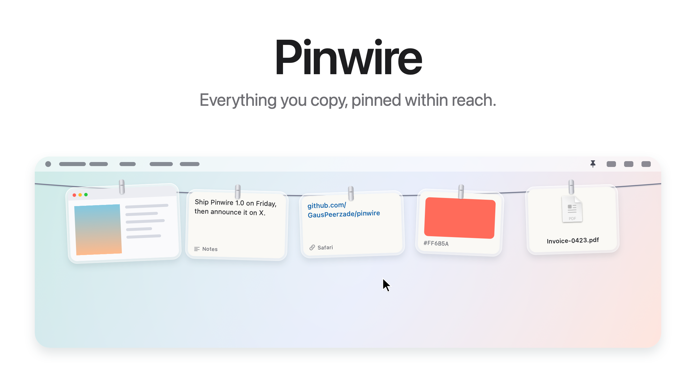
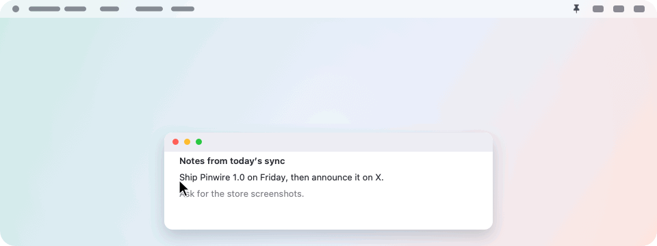
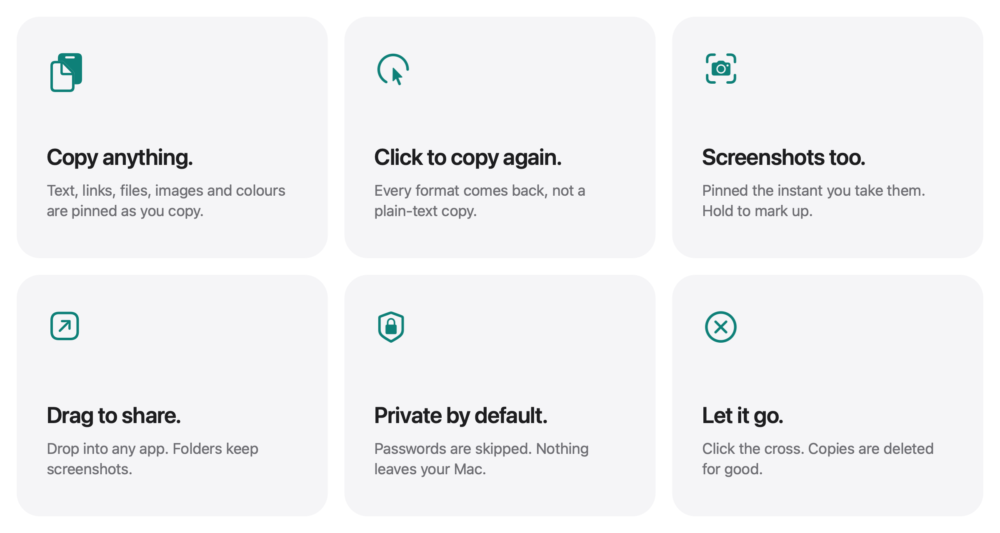
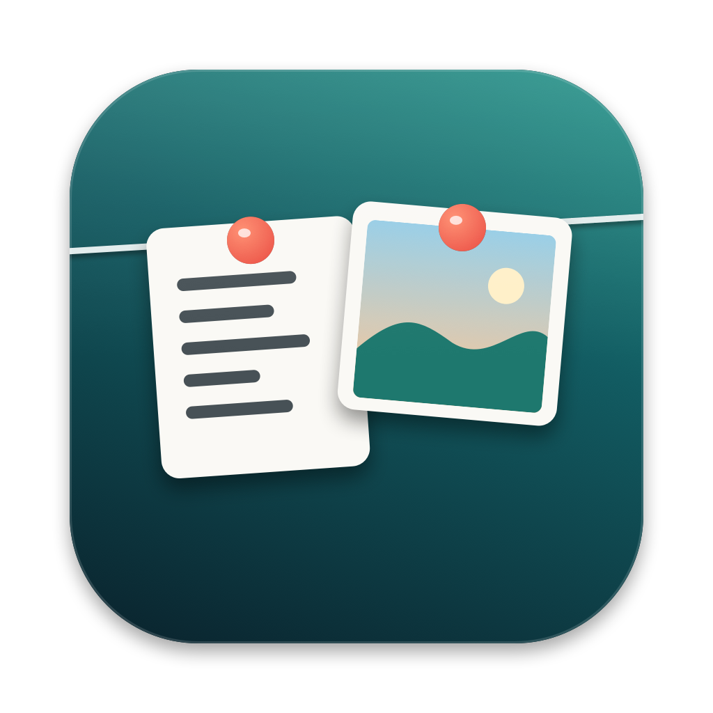

<picture>
  <source media="(prefers-color-scheme: dark)" srcset="docs/hero-dark.png">
  
</picture>

<p align="center">
  Free and open source. For macOS 14 and later.
  <br>
  <a href="https://github.com/GausPeerzade/pinwire/releases/latest">Download&nbsp;&rsaquo;</a>
  &nbsp;&nbsp;
  <a href="#install">Install with Homebrew&nbsp;&rsaquo;</a>
  &nbsp;&nbsp;
  <a href="#build-from-source">Build from source&nbsp;&rsaquo;</a>
</p>

<br>

## A clipboard you can see.

Your Mac only remembers the last thing you copied. Copy something new and
the old one is gone.

Pinwire keeps it. Everything you copy and every screenshot you take is
pinned to a thin wire hidden just above your screen. Rest the pointer in
the menu bar and the wire glides down. Click anything on it and it is on
your clipboard again, ready to paste.

<picture>
  <source media="(prefers-color-scheme: dark)" srcset="docs/demo-dark.gif">
  
</picture>

<br>
<br>

## Anything you copy.

Pinwire does not turn your copies into plain text. It keeps every format an
app put on the clipboard, so a click puts back exactly what you copied:
formatted text stays formatted, an image stays an image, a file stays a file.

| You copy | It hangs as | Click | Double click |
|:--|:--|:--|:--|
| Text or rich text | A note, with the app it came from | Copies it again, formatting included | — |
| A link | A note with the address | Copies the link | Opens it in your browser |
| One or more files in Finder | The file's icon and name | Copies the files | Opens them |
| An image | The picture | Copies the image | — |
| A colour | A swatch with its hex code | Copies the colour | — |
| A screenshot | The picture | Copies the image | Opens it in your image viewer |
| Anything else | A card naming the type | Copies it exactly | — |

Copy the same thing twice and it moves to the front instead of hanging twice.
When the wire is full, the oldest item falls off the far end. How many fit
depends on the width of your screen, from 3 to 12.

<br>

## A gesture for everything.

<picture>
  <source media="(prefers-color-scheme: dark)" srcset="docs/bento-dark.png">
  
</picture>

<br>
<br>

| | |
|:--|:--|
| Click | Copy it again. |
| Double click | Open the file, link or screenshot. |
| Press and hold a screenshot | Mark it up. |
| Drag into an app | Drop a copy there. It stays on the wire. |
| Drag a screenshot into a folder | Keep it there. It leaves the wire. |
| Click the cross | Take it down. |
| Right click | More options, like Show in Finder. |
| Rest the pointer in the menu bar | Bring the wire down on that screen. |
| Click anything in the menu bar | Put it away. |
| <kbd>⌃</kbd>&thinsp;<kbd>⌥</kbd>&thinsp;<kbd>P</kbd> | Show or hide the wire. |

<br>

## Screenshots too.

Pinwire picks up every screenshot you take with the usual shortcuts, or with
any app that saves screenshots to the same folder.

Hand Pinwire your screenshots<sup>1</sup> and they skip the Desktop
entirely. No floating thumbnail. No five-second wait. Each capture flies up
to the wire the instant you take it, and only what you drag out is kept.

<br>

## Private by design.

No account. No network. No analytics. Pinwire never connects to the internet,
and nothing you copy leaves your Mac.

- **You decide.** Pinning copies is off until you turn it on. Pinwire asks once
  and explains what it keeps.
- **Passwords are skipped.** Copies that apps mark as private or temporary,
  following the [nspasteboard.org](http://nspasteboard.org) convention that
  password managers use, are never saved.
  Copies made in Keychain Access and Passwords are skipped too.
- **Only for you.** Copies are saved in
  `~/Library/Application Support/Pinwire/Clips`, readable only by your user account.
- **Gone when you take it down.** A copy is kept only while it hangs on the
  wire. Take it down, or let it fall off the end, and it is deleted from disk.
- **Easy to pause.** Turn off **Pin copied items** in the menu bar at any time.

On recent versions of macOS, the system may ask whether Pinwire can read the
clipboard. Allow it for copies to be pinned. If you deny it, the menu bar
says so and takes you to the right setting.

<br>

## The menu bar.

Click the pin in the menu bar for:

| | |
|:--|:--|
| **Show wire** | Bring the wire down and keep it there until you move away. |
| **Take everything down** | Clear the wire. |
| **Pin copied items** | Turn pinning copies on or off. |
| **Handle screenshots** | Let Pinwire take over where screenshots are saved.<sup>1</sup> |
| **Open screenshots folder** | See the files behind your screenshots. |
| **Sounds** | The small sounds when something is pinned or taken down. |
| **Open at login** | Start Pinwire when you log in. |

<br>

## Small and fast.

| | |
|:--|:--|
| **Download** | 2.2 MB disk image |
| **Built with** | Swift, AppKit and SwiftUI. No third-party code. |
| **Network access** | None |
| **Compatibility** | macOS 14 Sonoma or later, on Apple silicon and Intel |
| **Languages** | English, Spanish |
| **Price** | Free |
| **License** | MIT |

Pinwire stays in the menu bar with no Dock icon. While the wire is hidden it
does no drawing at all, and it checks the clipboard twice a second by reading
a single counter, so it uses almost no energy when you are not using it.

<br>

## Install

With [Homebrew](https://brew.sh):

```sh
brew install --cask gauspeerzade/tap/pinwire
```

Or download the disk image from the [latest release](https://github.com/GausPeerzade/pinwire/releases/latest),
open it and drag Pinwire to Applications.

Pinwire is not notarized by Apple yet, so the first time macOS will say it
cannot verify it. Open System Settings, go to Privacy & Security, and click
Open Anyway next to the message about Pinwire. You only need to do this once.

On first launch Pinwire asks two questions: whether to handle your
screenshots, and whether to pin what you copy. Both can be changed later
from the menu bar.

### Uninstall

```sh
brew uninstall --cask --zap pinwire
```

Or quit Pinwire, drag it to the Trash, and delete
`~/Library/Application Support/Pinwire`. If Pinwire was handling your
screenshots, your previous settings are restored when it quits.

<br>

## Build from source

```sh
git clone https://github.com/GausPeerzade/pinwire.git
cd pinwire
scripts/build-app.sh
open build/Pinwire.app
```

Requires the Swift toolchain. Xcode is optional. With the Command Line Tools for macOS 27, the script falls back to the macOS 26 SDK they install alongside, because the new SDK needs a SwiftUI macro plugin only Xcode includes. Local builds are signed ad hoc,
so macOS asks again for access to the Desktop after each rebuild.

`scripts/make-dmg.sh` builds the disk image for a release and updates the
Homebrew cask with its version and checksum.

<details>
<summary>Inside the app</summary>
<br>

| File | Role |
|:--|:--|
| `AppDelegate.swift` | Menu bar, shortcut, revealing and tucking away the wire |
| `ClipboardWatcher.swift` | Notices new copies and skips private ones |
| `Clip.swift` | A copied item: capturing, saving, restoring and drawing its card |
| `ScreenshotWatcher.swift` | Notices new screenshots |
| `Inbox.swift` | Takes over screenshot settings and puts them back |
| `Line.swift` | What is hanging, and what you can do with it |
| `LinePanel.swift` | The transparent strip along the top of the screen |
| `LineView.swift` | The wire and where each item hangs |
| `PeggedView.swift` | One item: glass frame, clip, swing and breeze |
| `GrabArea.swift` | Click, long press, drag and drop |
| `CaptureFlight.swift` | A new screenshot flying up to the wire |
| `Markup.swift` | Opens the system Markup editor and saves the result |
| `FullScreen.swift` | Knows when to stay hidden |

Every image here, the icon included, is drawn in code by
`scripts/make-icon.swift` and `scripts/make-readme-art.swift`.

</details>

<br>

## Contributing

Issues and pull requests are welcome. Pinwire aims to stay small: no
dependencies, no network, nothing running while the wire is hidden. Please
keep changes in that spirit.

<br>

---

<sub>
1. With Handle screenshots on, Pinwire turns off the floating thumbnail and saves new screenshots to its own folder, two settings also found under Options in Cmd+Shift+5. Your previous settings are saved and restored when Pinwire quits or the option is turned off. Pinwire hides automatically while an app is in full screen.
</sub>

<br>
<br>

<p align="center">
  
  <br>
  <sub>MIT licensed. See <a href="LICENSE">LICENSE</a>.</sub>
</p>
